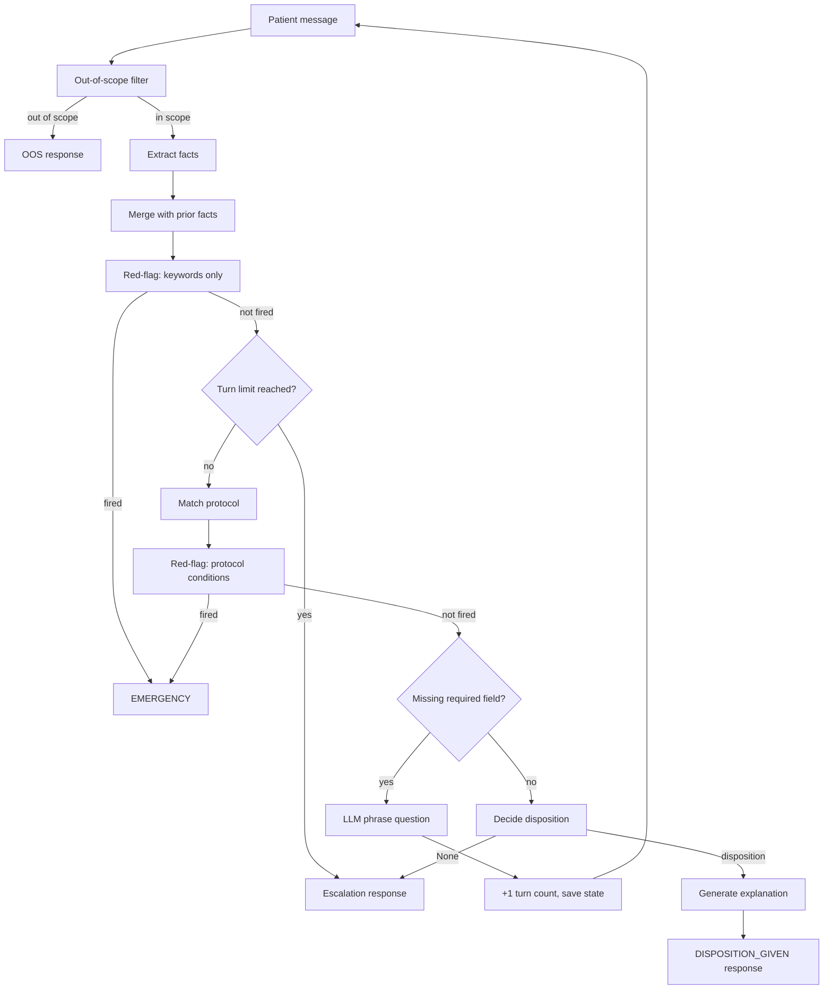

# Triage Copilot — Architecture

A patient describes symptoms in free text; the system extracts structured facts, checks for emergencies via pure-Python rules, matches a triage protocol, asks targeted follow-up questions, then recommends a care level (self-care, primary care, urgent care, emergency). This is care navigation, not diagnosis — it routes rather than diagnoses. A single LLM call can't do this: extraction, safety, protocol matching, and disposition each require different logic, and multiple turns may be needed before enough information exists.

The red-flag check runs twice per turn — keyword layer before protocol matching and protocol-condition layer after — so emergency detection does not depend on having chosen the correct protocol.

## Components

**Fact extraction** (`extraction/fact_extractor.py`) takes the patient's free-text message together with any previously extracted facts, builds a structured prompt, and calls an LLM to produce an `ExtractedFacts` object containing symptom category, severity, duration in minutes, a list of associated symptoms, explicit negatives, and history flags. The extraction prompt includes the full field schema and prior facts so the LLM sees the conversation context. When the LLM call fails — due to timeout, API error, or invalid JSON — a heuristic fallback takes over. The fallback uses regex to extract duration (with typo tolerance: `3o mins` normalizes to `30 mins`), a keyword map for severity (mapping 12+ severity descriptors to mild/moderate/severe), a history-flag map that recognizes 7 condition categories from keywords (cardiac history, hypertension, diabetes, stroke, afib/arrhythmia, prior cardiac intervention, trauma), and symptom-category patterns for all 6 supported protocols plus `general` as a catch-all. Every fallback path produces the same `ExtractedFacts` shape as the LLM path, so no downstream component needs to know which extraction path was taken.

**Red-flag detector** (`safety/red_flag_detector.py`) is pure Python with zero I/O or LLM calls — the safety layer must never depend on an external service. It runs two detection layers in sequence. The first layer scans the raw patient text against 60+ emergency trigger keywords ranging from obvious ("gunshot", "cannot breathe", "heart attack") to phrasing variants ("broken bone", "broken leg", "fracture", "breathlessness", "can't catch breath", "asthma attack", "having a stroke"). If any keyword matches, detection short-circuits immediately and returns an emergency disposition without consulting the protocol layer, which ensures that the detector cannot miss an emergency due to a protocol-matching failure. The second layer evaluates each red-flag condition defined in the matched protocol. These conditions support `all`/`any` logical composition across multiple facts and use field operators (`==`, `!=`, `<`, `>`, `in`, `contains`) evaluated against the extracted facts dictionary. For example, RF-CARDIAC-01 in the chest pain protocol fires when duration is under 60 minutes AND at least one of shortness_of_breath, sweating, or radiating pain is present in the associated symptoms list.

**Protocol matcher** (`guidance/matcher.py`) selects one of 7 YAML-defined protocols by comparing the extracted `symptom_category` against each protocol's `symptom_category` field. It attempts an exact match first, then a keyword-token overlap score (tokenizing both the extracted and protocol category on underscore/space boundaries and counting intersection size), and falls back to a catch-all `fallback_no_match` protocol when no candidate scores above zero. Each protocol is a flat YAML file in the `protocols/` directory listing its red-flag rules, required fields, disposition rules (each with a condition and a target care level), and safety-netting text. Adding a new protocol requires only a new YAML file — no Python changes.

**Question selector** (`questioning/question_selector.py`) finds the first required field from the matched protocol that does not yet have a non-null value in the extracted facts, then delegates to an LLM to phrase a natural-language question for that specific field. It asks exactly one question per turn rather than running an exhaustive intake script, so the conversation adapts to what is already known.

**Disposition engine** (`disposition/disposition_engine.py`) evaluates the matched protocol's `disposition_rules` in order and returns the first rule whose condition evaluates to true. Before evaluating each rule, it checks whether the rule's condition depends on any fact that is still missing — if so, the rule is skipped rather than evaluated with a null value. This means mild rules that depend only on severity get evaluated early, while moderate rules that also depend on duration are deferred until duration is collected. When no rule matches (all conditions false or deferred due to missing fields), the engine returns `None`, and the controller escalates to an uncertainty-driven emergency response.

**Explanation generator** (`explanation/explanation_generator.py`) builds a prompt from the disposition result, a JSON representation of the extracted facts, and the protocol's safety-netting text, then calls an LLM to produce a human-readable explanation. After the LLM responds, the generator runs `is_grounded()` — a token-allowlist check that rejects explanations containing symptom-describing tokens not present in the extracted facts — and falls back to a deterministic template with the protocol's safety-netting text if the LLM introduced unsupported content. Groundedness is enforced by code, not by prompting alone.

## Model Choice

From `models.yaml`: fact extraction uses `google/gemma-4-31b-it:free` (OpenRouter, primary) with `meta/llama-3.1-70b-instruct` (NVIDIA NIM, fallback) — the free tier keeps development cost near zero while the fallback provides reliable coverage under rate limits. Question phrasing uses `google/gemma-3-12b-it` (OpenRouter with no fallback) because the task of rephrasing a field name as a conversational question is small enough that a compact model is sufficient. Explanation generation uses `gemini-3.5-flash` (Google AI Studio, primary) with `anthropic/claude-3.5-sonnet` (OpenRouter, fallback) — flash offers fast, low-cost generation and claude serves as a dependable backup.

## Safety Guarantee

The red-flag check runs unconditionally on every turn before any other branching logic — a keyword-only pass before protocol matching and a protocol-condition pass after — so no code path can produce a non-emergency response without passing through the detector. The test suite at `tests/unit/test_red_flag_detector.py` verifies this invariant: one test confirms that the keyword layer fires ahead of protocol conditions even when the protocol would have no match, and another test confirms that protocol conditions still fire when no keyword matches but structured facts satisfy a red-flag rule.

## Trade-Off

The protocol matcher selects by exact category match then token-overlap scoring across all loaded protocols — an O(n) linear scan that works for the current 7 protocols but will not scale past approximately 15-20 without a dedicated retrieval layer (embedding-based or inverted index). The YAML-as-code convention keeps protocol authorship accessible to non-developers and makes version control of triage logic straightforward, but if the protocol set grows significantly, the matching strategy must be replaced before the scoring ambiguity reaches a critical threshold.
